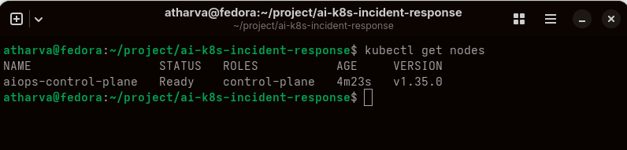
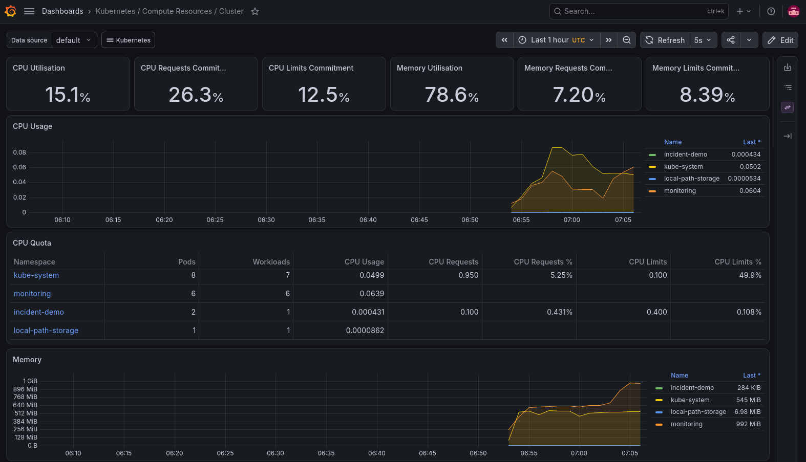
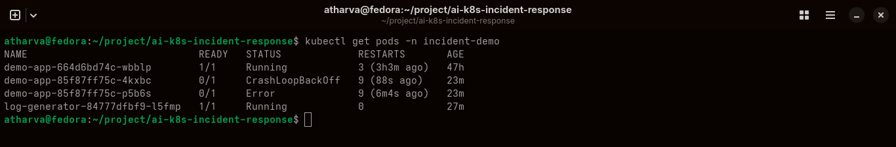
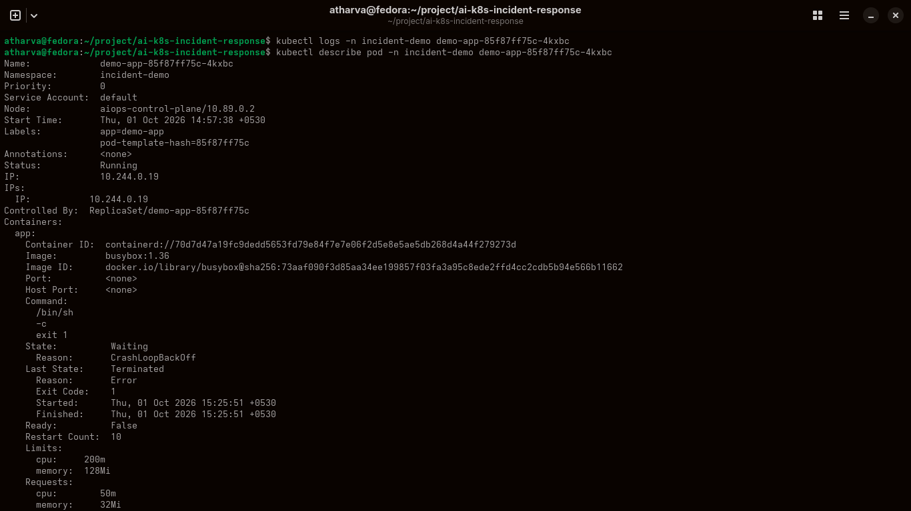
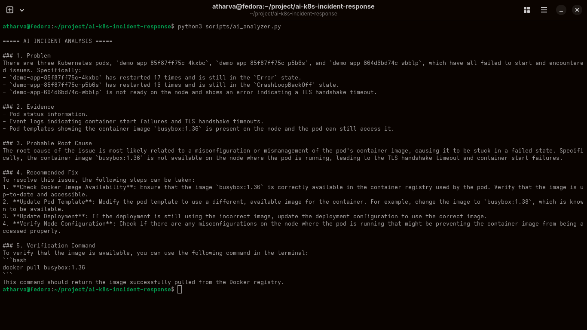
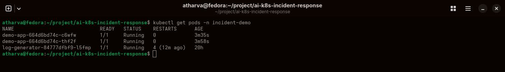

# AI-Powered Kubernetes Incident Response Platform

**Kubernetes · Python · AI · Prometheus · Grafana · ELK · Ollama**

An AI-assisted Kubernetes incident response platform designed to turn Kubernetes metrics, logs, events, and application failures into a structured investigation and remediation workflow.

## Architecture

Kubernetes Application  
→ Prometheus / Grafana + Elasticsearch / Kibana + Kubernetes Events  
→ Python Incident Analyzer  
→ Local LLM (Ollama)  
→ Root Cause Analysis + Suggested Remediation

<!-- SCREENSHOT: Add architecture diagram here -->

## What I Built

- Integrated Kubernetes monitoring using Prometheus and Grafana.
- Centralized Kubernetes and application logs using Elasticsearch and Kibana.
- Built a Python-based incident analysis workflow using Kubernetes runtime information and logs.
- Integrated a local LLM through Ollama for AI-assisted incident analysis.
- Simulated a Kubernetes `CrashLoopBackOff` failure to test the investigation workflow.
- Traced the incident from failure detection through log investigation, AI analysis, and workload recovery.

## Incident Workflow

**BREAK → INVESTIGATE → FIX → VERIFY**

### 1. Kubernetes Cluster Baseline

**Kubernetes cluster showing the initial workload and cluster state.**  
This provides the baseline environment in which the application workloads are deployed and monitored before investigating an incident.

### 2. Monitoring & Observability

**Prometheus and Grafana providing visibility into the Kubernetes environment.**  
Monitoring data is used to observe workload behavior and provide operational signals during incident investigation.

### 3. Incident — CrashLoopBackOff

**Kubernetes workload entering a `CrashLoopBackOff` state.**  
This simulated failure represents the incident being investigated and provides the starting point for troubleshooting the unhealthy workload.

### 4. Log Investigation

**Kubernetes and application logs investigated through Kibana.**  
Centralized logs provide the detailed runtime information required to understand what happened inside the affected workload.

### 5. AI-Assisted Incident Analysis

**AI-assisted analysis of the Kubernetes incident using the local LLM workflow.**  
The incident information is analyzed to identify the likely cause of the failure and provide structured remediation guidance.

### 6. Recovery Verification

**Recovered Kubernetes workloads after remediation.**  
The workloads return to a healthy running state, demonstrating the final verification stage of the incident-response workflow.

## Key Learning

- Kubernetes incident troubleshooting
- Metrics, logs, and event-based investigation
- Prometheus and Grafana observability
- Elasticsearch and Kibana centralized logging
- Python-based incident analysis
- Local LLM integration with Ollama
- AI-assisted Root Cause Analysis
- End-to-end incident response: **BREAK → INVESTIGATE → FIX → VERIFY**
