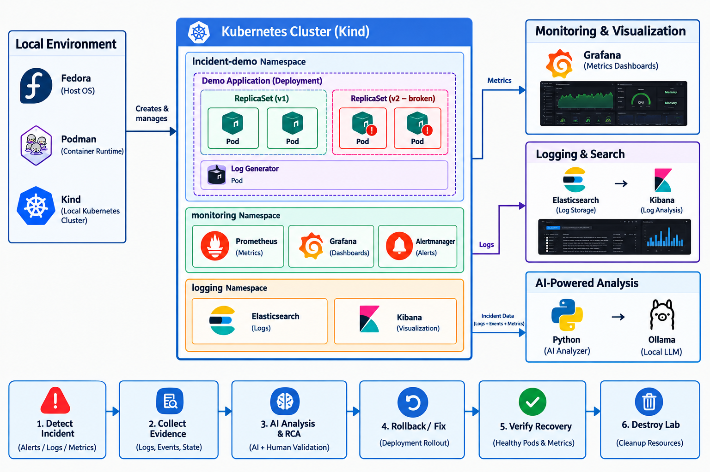

# AI-Powered Kubernetes Incident Response Platform

**Kubernetes · Python · AI · Prometheus · Grafana · ELK · Ollama**

An AI-assisted Kubernetes incident response platform designed to turn scattered Kubernetes signals into a structured investigation and remediation workflow.

## Architecture

Kubernetes Application  
→ Prometheus / Grafana + Elasticsearch / Kibana + Kubernetes Events  
→ Python Incident Analyzer  
→ Local LLM (Ollama)  
→ Root Cause Analysis + Suggested Remediation

<!-- SCREENSHOT: Add architecture diagram here -->

## What I Built

- Integrated Kubernetes monitoring using Prometheus and Grafana.
- Centralized application and Kubernetes logs using Elasticsearch and Kibana.
- Built Python-based incident analysis using Kubernetes logs, events and monitoring data.
- Integrated a local LLM with Ollama to analyze incidents and suggest remediation.
- Simulated Kubernetes failures such as `CrashLoopBackOff` and validated the investigation workflow.
- Tested the complete flow from failure detection → investigation → root cause → recovery.

## Incident Workflow

**BREAK → INVESTIGATE → FIX → VERIFY**

<!-- SCREENSHOT: Kubernetes nodes / pods -->

<!-- SCREENSHOT: Prometheus / Grafana dashboard -->

<!-- SCREENSHOT: CrashLoopBackOff + logs -->

<!-- SCREENSHOT: Kibana logs -->

<!-- SCREENSHOT: AI-generated incident analysis -->

<!-- SCREENSHOT: Recovered / all pods Running -->

## Key Learning

- Kubernetes incident troubleshooting
- Observability and centralized logging
- Python automation and log analysis
- AI-assisted Root Cause Analysis
- Production-style incident investigation
